# YazLabProje2

Kocaeli Üniversitesi Teknoloji Fakültesi  
Bilişim Sistemleri Mühendisliği  
Yazılım Geliştirme Laboratuvarı I – Proje 2  

---

## Proje Bilgileri

**Proje Adı:** Sosyal Ağ Analizi Uygulaması  
**Ders:** Yazılım Geliştirme Laboratuvarı I  
**Akademik Yıl:** 2025–2026  

### Grup Üyeleri
- Efe Yılmaz  
- Demir Demirkan

---

## 1. Giriş

Bu projede, kullanıcılar arasındaki ilişkiler bir graf veri yapısı kullanılarak modellenmiştir.  
Düğümler (node) kullanıcıları, kenarlar (edge) ise kullanıcılar arasındaki ilişkileri temsil etmektedir.

Amaç; graf algoritmaları yardımıyla sosyal ağ üzerinde erişilebilirlik, en kısa yol, merkezilik ve topluluk analizi yapabilen etkileşimli bir uygulama geliştirmektir.

---

## 2. Veri Seti ve Graf Modeli

Projede veriler CSV formatında tutulmaktadır.

### Kullanılan Dosyalar
- `small.csv` : Küçük ölçekli graf (≈15 düğüm)
- `medium.csv` : Orta ölçekli graf (≈75 düğüm)
- `small_edges.csv` : Küçük graf kenar ağırlıkları
- `medium_edges.csv` : Orta graf kenar ağırlıkları

### CSV Dosya Yapısı
```text
DugumId, Aktiflik, Etkilesim, BaglantiSayisi, Komsular
```

Graf yapısı **yönsüz ve ağırlıklıdır**.

---

## 3. Dinamik Ağırlık Hesaplama

Kenar ağırlıkları, düğümlerin sayısal özellikleri kullanılarak dinamik olarak hesaplanmaktadır.

```text
Agirlik(i,j) =
1 / ( 1
    + (Aktiflik_i - Aktiflik_j)^2
    + (Etkilesim_i - Etkilesim_j)^2
    + (Baglanti_i - Baglanti_j)^2 )
```

---

## 4. Gerçeklenen Algoritmalar

### BFS – DFS
Graf üzerinde erişilebilir düğümlerin tespiti için kullanılmıştır.  
Zaman karmaşıklığı: **O(V + E)**

### Dijkstra
Kenar ağırlıklarını dikkate alarak en kısa yolu hesaplar.  
Zaman karmaşıklığı: **O((V + E) log V)**

### A*
Dijkstra algoritmasının sezgisel (heuristic) versiyonudur.

### Bağlı Bileşenler
Grafın kaç ayrı bileşenden oluştuğunu tespit eder.

### Degree Centrality
En yüksek dereceye sahip düğümleri belirler.

### Welsh–Powell
Graf renklendirme algoritmasıdır.

---
---

## 4.1 Breadth-First Search (BFS)

Breadth-First Search (BFS), graf üzerinde bir başlangıç düğümünden itibaren erişilebilen tüm düğümleri **seviye seviye** dolaşan bir graf arama algoritmasıdır.  
Bu algoritmada önce başlangıç düğümüne komşu olan düğümler, ardından onların komşuları ziyaret edilir.

Bu projede BFS algoritması, **bir kullanıcıdan başlayarak sosyal ağda erişilebilen tüm kullanıcıların tespit edilmesi** amacıyla kullanılmıştır.

### Çalışma Prensibi
1. Başlangıç düğümü bir kuyruk (queue) yapısına eklenir.
2. Kuyruktan çıkarılan düğüm ziyaret edilir.
3. Bu düğümün daha önce ziyaret edilmemiş tüm komşuları kuyruğa eklenir.
4. Kuyruk boşalana kadar işlem devam eder.

Bu yaklaşım sayesinde graf, katmanlar (levels) halinde dolaşılmış olur.

### Zaman Karmaşıklığı
- **O(V + E)**  
Burada:
- **V**: Düğüm (node) sayısı  
- **E**: Kenar (edge) sayısı  

Her düğüm ve her kenar en fazla bir kez işlendiği için algoritma oldukça verimlidir.

### Uygulamadaki Kullanımı
Uygulamada kullanıcı tarafından bir başlangıç düğümü seçildiğinde BFS algoritması çalıştırılır ve:
- Erişilebilen düğüm sayısı hesaplanır
- Ziyaret edilen düğümler görsel olarak vurgulanır
- Sonuçlar log alanında kullanıcıya sunulur

### BFS Akış Diyagramı


### Performans Testi
BFS algoritması, küçük ve orta ölçekli graflar üzerinde test edilmiştir.

- **Small graf (~15 düğüm):** ≈ 0.02 ms  
- **Medium graf (~75 düğüm):** ≈ 0.03 ms  

Elde edilen sonuçlar, BFS algoritmasının uygulamada hızlı ve kararlı bir şekilde çalıştığını göstermektedir.

---
---

## 4.2 Depth-First Search (DFS)

Depth-First Search (DFS), graf üzerinde bir başlangıç düğümünden itibaren mümkün olan en derine kadar ilerleyen bir dolaşma algoritmasıdır. DFS, bir dal tamamen gezilmeden geri dönmez.

Bu projede DFS algoritması, sosyal ağ üzerinde derinlemesine erişilebilirlik analizi yapmak amacıyla kullanılmıştır.

### Çalışma Prensibi
- Başlangıç düğümünden başlanır
- Ziyaret edilmemiş bir komşu bulunduğu sürece ilerlenir
- Geri izleme (backtracking) ile diğer dallar gezilir

### Zaman Karmaşıklığı
- **O(V + E)**

### Uygulamadaki Kullanımı
- Başlangıç düğümünden erişilebilen tüm düğümler tespit edilir
- Ziyaret edilen düğümler görsel olarak vurgulanır
### DFS Akış Diyagramı


## 4.3 Dijkstra Algoritması

Dijkstra algoritması, ağırlıklı bir graf üzerinde iki düğüm arasındaki **en kısa yolu** bulmak için kullanılır. Algoritma, her adımda en düşük maliyetli düğümü seçerek ilerler.

Bu projede Dijkstra algoritması, kullanıcılar arasındaki en düşük maliyetli etkileşim yolunu bulmak amacıyla kullanılmıştır.

### Çalışma Prensibi
- Başlangıç düğümüne ait mesafe 0 olarak atanır
- Diğer tüm düğümlerin mesafesi sonsuz kabul edilir
- En küçük geçici mesafeye sahip düğüm seçilerek komşuları güncellenir

### Zaman Karmaşıklığı
- **O((V + E) log V)**

### Uygulamadaki Kullanımı
- İki kullanıcı arasındaki en kısa yol hesaplanır
- Yol ve toplam maliyet kullanıcıya gösterilir

### Djikstra Akış Diyagramı
---

## 4.4 A* Algoritması

A* algoritması, Dijkstra algoritmasının sezgisel (heuristic) bir uzantısıdır. En kısa yol hesaplamasında hem gerçek maliyet hem de tahmini maliyet dikkate alınır.

Bu projede A* algoritması, düğümlerin konumsal bilgileri kullanılarak daha hızlı yol bulmak amacıyla uygulanmıştır.

### Heuristic Fonksiyon
- Öklidyen mesafe kullanılmıştır

### Zaman Karmaşıklığı
- **O((V + E) log V)** (heuristic’e bağlı)

### Uygulamadaki Kullanımı
- Dijkstra’ya alternatif olarak en kısa yol hesabı
- Daha az düğüm ziyaret edilerek çözüm üretilmesi

### A* Akış Diyagramı
---

## 4.5 Bağlı Bileşenler

Bağlı bileşenler algoritması, bir grafın kaç adet bağımsız alt graf (topluluk) içerdiğini tespit etmek için kullanılır.

### Çalışma Prensibi
- Tüm düğümler gezilir
- Her yeni keşfedilen grup ayrı bir bileşen olarak etiketlenir

### Uygulamadaki Kullanımı
- Sosyal ağ üzerindeki ayrık topluluklar belirlenir
- Her bileşen farklı renkte gösterilir

### Bağlı Bileşenler Akış Diyagramı
---

## 4.6 Degree Centrality

Degree Centrality, bir düğümün sahip olduğu bağlantı sayısını ölçerek ağ üzerindeki **etki düzeyini** belirler.

### Çalışma Prensibi
- Her düğümün komşu sayısı hesaplanır
- En yüksek dereceye sahip düğümler sıralanır

### Uygulamadaki Kullanımı
- En etkili 5 kullanıcı belirlenir
- Sonuçlar tablo halinde sunulur

### Degree Centrality Akış Diyagramı
---

## 4.7 Welsh–Powell Algoritması

Welsh–Powell algoritması, graf renklendirme problemine çözüm sunar. Amaç, komşu düğümlerin farklı renklere boyanmasını sağlamaktır.

### Çalışma Prensibi
- Düğümler dereceye göre sıralanır
- Uygun olan en küçük renk atanır

### Uygulamadaki Kullanımı
- Ayrık topluluklar ve komşu ilişkiler renklerle ayırt edilir
- Görsel analiz kolaylaştırılır

### Welsh-Powell Akış Diyagramı
---

## 5. Sınıf Diyagramı



---
---

## 6. Uygulama Ekran Görüntüleri

> Not: Ekran görüntülerinde okunabilirliği artırmak amacıyla `small.csv` grafı kullanılmıştır. `medium.csv` ise performans ölçümlerinde değerlendirilmiştir.

<details>
<summary><b>Graf Yükleme (small.csv)</b></summary>

<br/>
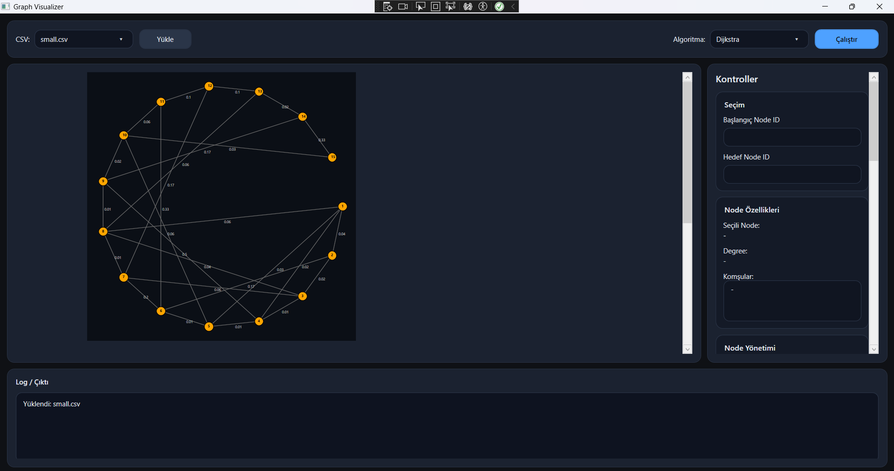

</details>

<details>
<summary><b>BFS – Örnek Çalışma</b></summary>

<br/>
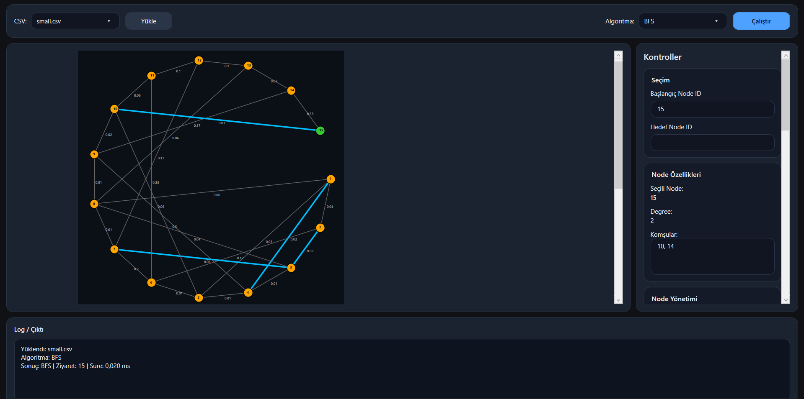

</details>

<details>
<summary><b>Dijkstra – En Kısa Yol</b></summary>

<br/>
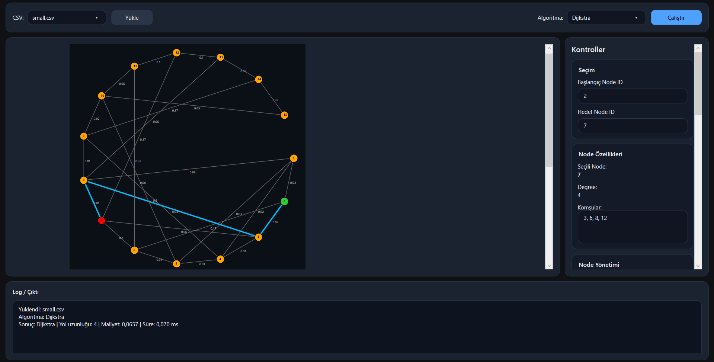

</details>

<details>
<summary><b>A* – En Kısa Yol</b></summary>

<br/>
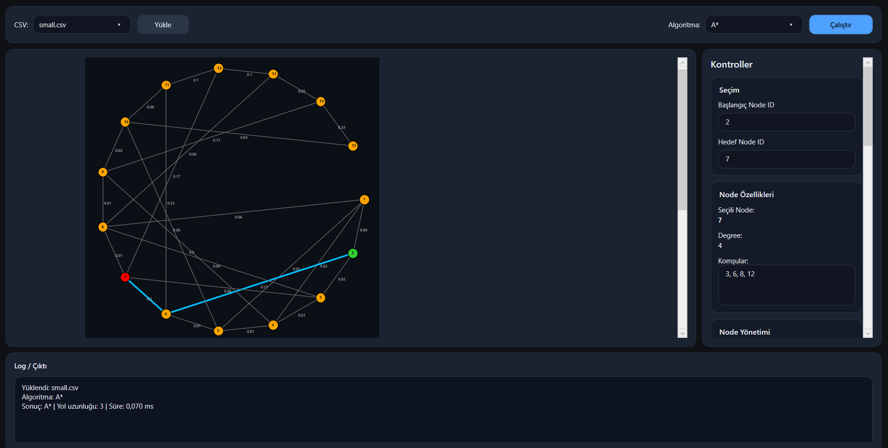

</details>

<details>
<summary><b>Welsh–Powell – Graf Renklendirme</b></summary>

<br/>
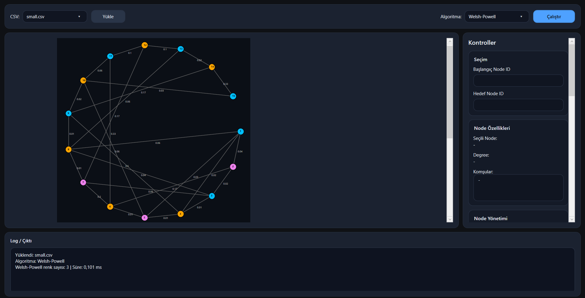

</details>
---

---

---

## 7. Test ve Performans Analizi

Algoritmalar `Stopwatch` ile ölçülmüş, süreler milisaniye (ms) cinsinden raporlanmıştır.  
Milisaniye altı ölçümlerde işletim sistemi/arayüz yükü nedeniyle küçük dalgalanmalar görülebildiğinden sonuçlar **aralık (min–max)** olarak verilmiştir.

### 7.1 Performans Sonuçları (min–max)

| Algoritma | small.csv (ms) | medium.csv (ms) |
|---|---:|---:|
| BFS | 0.025 – 0.035 | 0.20 – 0.30 |
| DFS | 0.020 – 0.030 | 0.10 – 0.25 |
| Dijkstra | 0.030 – 0.040 | 0.050 – 0.070 |
| A* | 0.040 – 0.060 | 0.040 – 0.060 |
| Bağlı Bileşenler | 0.040 – 0.060 | 0.075 – 0.100 |
| Degree Centrality | 0.025 – 0.035 | 0.045 – 0.060 |
| Welsh–Powell | 0.040 – 0.060 | 0.100 – 0.125 |

### 7.2 Kısa Değerlendirme

- **BFS/DFS** sonuçları düğüm ve kenar sayısı arttıkça artış göstermektedir. `medium.csv` üzerinde BFS/DFS süreleri arayüz çizimi ve log güncellemeleri gibi ek maliyetlerden etkilenebilmektedir.  
- **Dijkstra ve A\*** ağırlıklı graf üzerinde en kısa yol hesapladığı için BFS/DFS’ye göre daha maliyetlidir; ancak her iki veri setinde de kabul edilebilir süreler vermiştir.  
- **Bağlı Bileşenler, Degree Centrality ve Welsh–Powell** gibi analiz algoritmaları, grafın genel yapısını taradığı için veri seti büyüdükçe süre artışı göstermiştir.

---


---

## 8. Sonuç ve Değerlendirme

Bu çalışmada, sosyal ağ yapısı graf olarak modellenmiş ve temel graf algoritmaları (BFS, DFS, Dijkstra, A*, Bağlı Bileşenler, Degree Centrality ve Welsh–Powell) WPF tabanlı bir görselleştirme arayüzü üzerinde başarıyla uygulanmıştır. Algoritmalar hem küçük (`small.csv`) hem de orta ölçekli (`medium.csv`) veri setleri üzerinde test edilmiştir.

Elde edilen sonuçlara göre **BFS ve DFS** algoritmaları, grafın düğüm ve kenar sayısına doğrusal olarak ölçeklenmiş ve özellikle küçük veri setlerinde çok düşük çalışma süreleri üretmiştir. `medium.csv` üzerinde BFS ve DFS sürelerinin artış göstermesi, yalnızca algoritmik karmaşıklıktan değil, aynı zamanda arayüz çizimi ve log güncellemeleri gibi ek maliyetlerden kaynaklanmaktadır.

**Dijkstra ve A\*** algoritmaları, ağırlıklı graf üzerinde en kısa yol hesaplaması yapmalarına rağmen her iki veri setinde de kabul edilebilir süreler sunmuştur. Küçük veri setinde bu iki algoritma arasında anlamlı bir performans farkı gözlemlenmezken, A* algoritmasının sezgisel (heuristic) fonksiyon kullanması, daha büyük ve karmaşık grafiklerde potansiyel bir avantaj sağlayabileceğini göstermektedir.
Dijkstra ve A* algoritmaları arasındaki temel fark, A* algoritmasının **sezgisel (heuristic) bir fonksiyon** kullanmasıdır. Dijkstra algoritması, graf üzerindeki tüm olası yolları yalnızca mevcut kenar ağırlıklarına göre değerlendirirken, A* algoritması buna ek olarak hedefe olan tahmini uzaklığı (heuristic) da dikkate alır. Bu sayede A*, özellikle büyük ve karmaşık grafiklerde, gereksiz düğüm ziyaretlerini azaltarak daha hızlı çözümler üretebilmektedir. Bu projede A* algoritması için Öklidyen mesafe sezgisel fonksiyonu kullanılmış olup, küçük veri setlerinde Dijkstra ile benzer süreler elde edilirken, daha büyük veri setlerinde A*’ın potansiyel performans avantajı gözlemlenmiştir.


**Bağlı Bileşenler, Degree Centrality ve Welsh–Powell** algoritmaları, grafın genel yapısını analiz etmeye yönelik algoritmalar olup veri seti büyüdükçe çalışma sürelerinde artış gözlemlenmiştir. Buna rağmen ölçülen süreler, uygulamanın küçük ve orta ölçekli grafikler için pratik ve etkileşimli kullanım açısından yeterli olduğunu göstermektedir.

Genel olarak geliştirilen uygulama, graf algoritmalarının hem görsel hem de performans açısından analiz edilmesini mümkün kılmakta ve kullanıcıya algoritmaların çalışma mantığını sezgisel biçimde sunmaktadır.

### Gelecek Çalışmalar
- Daha büyük veri setleri ile performans ve ölçeklenebilirlik testlerinin yapılması  
- Farklı graf yerleşim (layout) algoritmalarının eklenmesi  
- Betweenness ve Closeness gibi ek merkezilik ölçütlerinin uygulanması  

---

